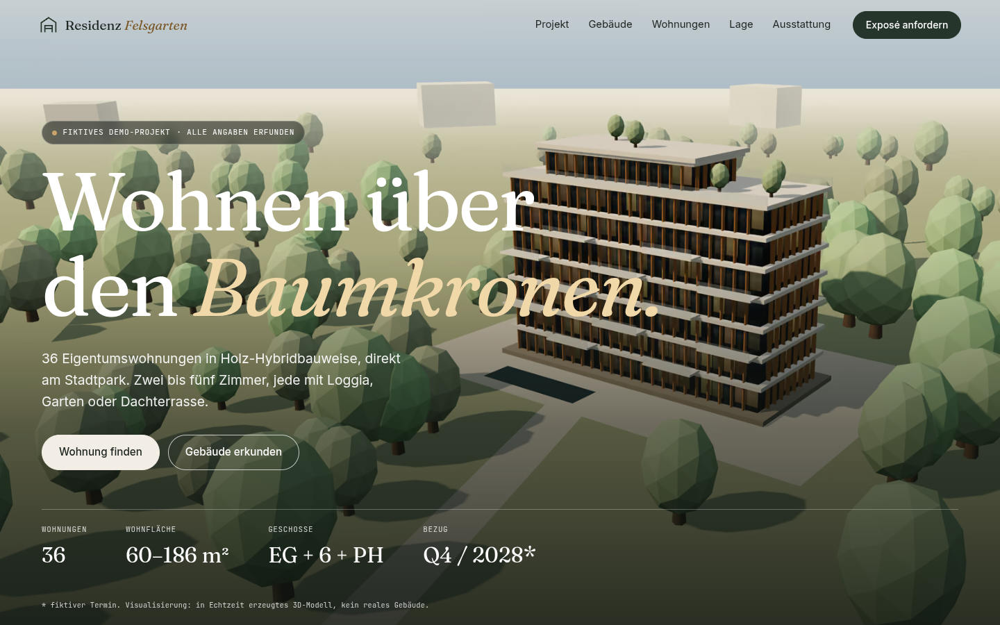
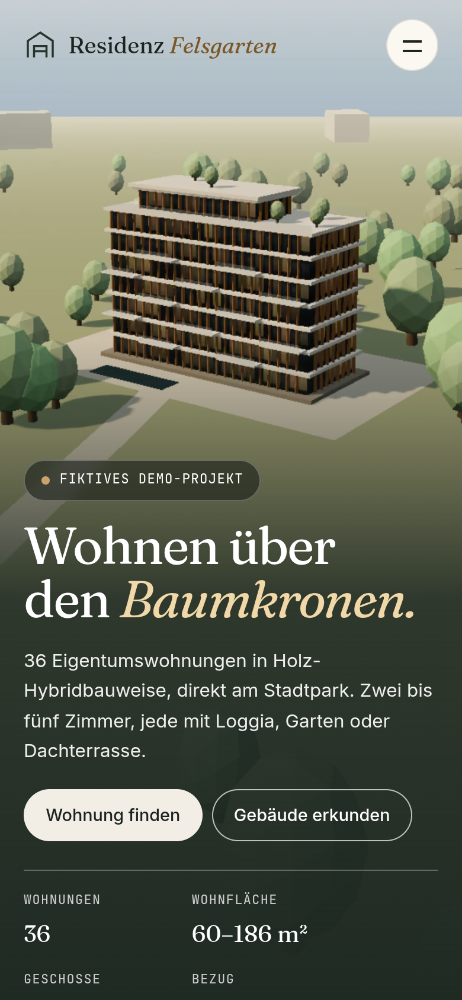
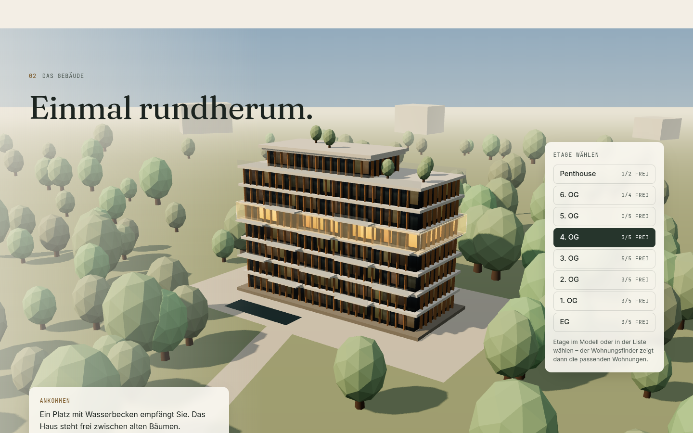
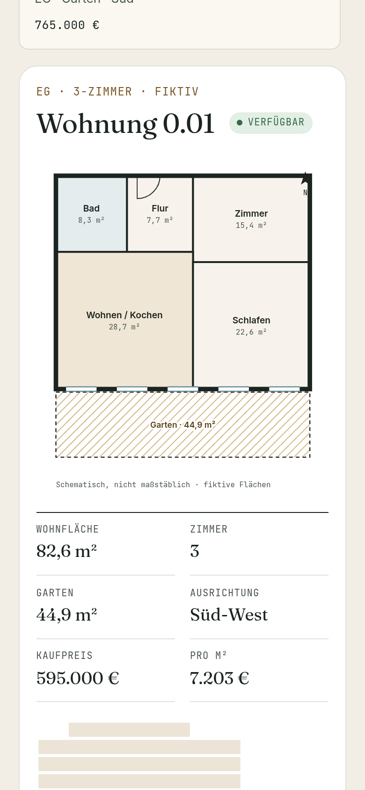
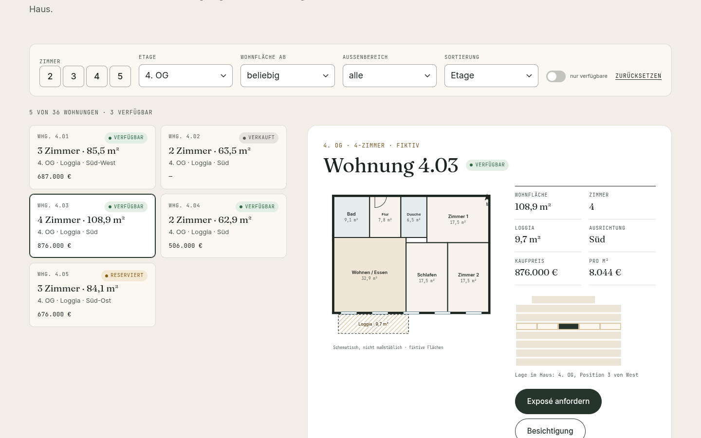
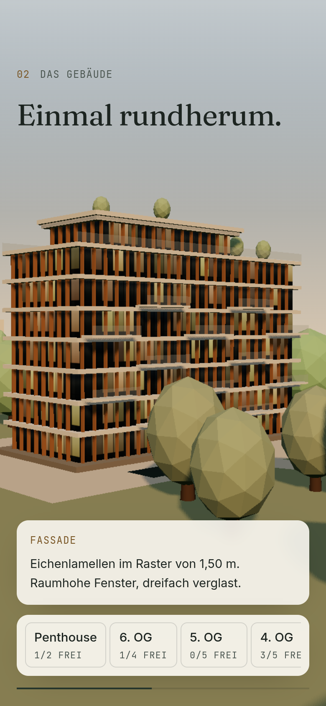

# Residenz Felsgarten – Demo-Website für ein Neubauprojekt

> **Fiktives Projekt.** Gebäude, Wohnungen, Preise, Termine, Bauträger, Adresse und Kontaktdaten sind erfunden.
> Die Fotos sind frei lizenzierte Musterbilder und zeigen nicht das Projekt.

**Live:** https://alper3019-ux.github.io/residenz-felsgarten/

Eine verkaufsfertige Vorlage für die digitale Vermarktung von Wohnimmobilien („Residenz-Launch“):
3D-Kamerafahrt um ein prozedural erzeugtes Gebäude, klickbare Etagen, Wohnungsfinder mit Grundrissen,
illustrierte Lage ohne Kartendienst, Exposé-Anfrage – barrierearm und DSGVO-schonend (keine Drittanbieter).

| Desktop | Mobil |
| --- | --- |
|  |  |
|  |  |
|  |  |

## Was drin ist

- **3D-Gebäude (Three.js r186, prozedural):** sieben Geschosse + Staffelgeschoss, Fensterraster als Canvas-Texturen (inkl. Leucht-Map), Eichenlamellen und ~260 Bäume als `InstancedMesh`, Loggien mit Glasbrüstung, Dachterrasse, Platz mit Wasserbecken. Keine fremden Modelle.
- **Kamerafahrt:** gepinnte Bühne (GSAP ScrollTrigger + Lenis). Die Kamera läuft als Orbit in Polarkoordinaten (Winkel, Abstand, Höhe) auf einer Catmull-Rom-Kurve – sie umkreist das Haus knapp 360° und schneidet es nie. Licht wechselt von Nachmittag zur blauen Stunde, die Fenster leuchten auf. Gerendert wird nur, solange sich etwas bewegt.
- **Etagen wählen:** im Modell per Raycaster (Hover-Tooltip, Klick) oder über die Etagenliste (echte Buttons mit „x/y frei“). Beides filtert den Wohnungsfinder; der Fokus springt auf dessen Überschrift.
- **Wohnungsfinder:** 36 Wohnungen (deterministisch erzeugt), Filter nach Zimmer, Etage, Fläche, Außenbereich, Verfügbarkeit, Sortierung, Live-Ergebniszahl (`role="status"`). Detail mit SVG-Grundriss (Räume mit m², Fenster, Tür, Außenbereich schraffiert), Gebäudeschnitt mit Position, CTAs „Exposé“/„Besichtigung“ füllen das Formular vor. Wechsel über die **View Transitions API** (`document.startViewTransition`, Fallback ohne Animation).
- **Lage:** eigene SVG-Illustration; Wege zeichnen sich beim Scrollen (`stroke-dashoffset`), Umschalter Zu Fuß / Rad / ÖPNV (`aria-pressed`). Keine Google-Maps-/OSM-Einbindung.
- **Ausstattung:** 5 Musterfotos von Wikimedia Commons (CC BY 2.0 bzw. CC0), selbst gehostet als AVIF + WebP in mehreren Breiten, Nachweis in der Bildunterschrift und auf `bildrechte.html`.
- **Kontakt/Exposé:** Demo-Modus – sendet und speichert nichts und sagt das deutlich. Barrierefreie Validierung (`aria-invalid` erst nach Absenden, `aria-describedby`, Fokus aufs erste Fehlerfeld). Umschaltbar auf `mailto` über `VITE_FORM_MODE`.
- **Rechtliches:** Impressum, Datenschutz, Bildrechte, 404 – alle Platzhalter als fiktiv markiert.
- **Bewegung reduzieren / kein WebGL:** kein Pin, kein Smooth Scroll, statisches Standbild der eigenen Szene, alle Funktionen (Etagenliste → Finder) bleiben nutzbar.

## Technik

Vite 8 · Three.js 0.186 · GSAP 3.15 (ScrollTrigger) · Lenis 1.3 · selbst gehostete Schriften (Fraunces, Inter, JetBrains Mono; OFL) · kein Framework.

```bash
npm install
npm run dev                 # http://localhost:5173/residenz-felsgarten/
npm run build               # dist/
node scripts/serve-dist.mjs dist 4191   # mit BASE=/residenz-felsgarten (Brotli, wie Produktion)
npm run audit -- <url> reports/<name> 3 # Lighthouse mobil+desktop (Median) + axe
node scripts/interaction-test.mjs       # Etagen → Finder → Formular, normal + reduziert
npm run screenshots                     # screens/
bash scripts/deploy-gh-pages.sh         # Build + normaler Push auf Branch gh-pages
```

Weitere Skripte: `scripts/process-photos.mjs` (Originale → AVIF/WebP), `scripts/render-poster.mjs` (Standbild der eigenen 3D-Szene für Hero, Fallback und OG-Bild; benötigt laufenden Dev-Server und `tools/poster.html`), `scripts/make-icons.mjs`.

Konfiguration über `.env`: `VITE_BASE`, `VITE_SITE_URL`, `VITE_FORM_MODE` (`demo` | `mailto`), `VITE_CONTACT_EMAIL`.
Wohnungsdaten: `src/data/apartments.js` – für ein echtes Projekt durch Daten aus CRM/CSV ersetzen.

## Messwerte

Gemessen am 09.10.2026 gegen die **Live-Seite** (GitHub Pages), Lighthouse 13.5 (Standard-Drosselung), Median aus 5 Läufen je Formfaktor, axe-core 4.14 nach Durchscrollen. Rohdaten-Zusammenfassung: [`reports/live/summary.json`](reports/live/summary.json).

| Lighthouse | Performance (Läufe) | Barrierefreiheit | Best Practices | SEO | FCP | LCP | TBT | CLS |
| --- | --- | --- | --- | --- | --- | --- | --- | --- |
| Mobil | **94** (94/81/83/94/96) | 100 | 100 | 100 | 2.12 s | 2.40 s | 11 ms | 0.008 |
| Desktop | **100** (100/100/100/100/100) | 100 | 100 | 100 | 0.47 s | 0.54 s | 0 ms | 0.012 |

- **axe-core:** 0 Verstöße auf der Startseite (Desktop 1440×900 und Mobil 390×844) sowie auf Impressum, Datenschutz, Bildrechte und 404 ([`reports/live/subpages.txt`](reports/live/subpages.txt)).
- **Interaktionstest** (`scripts/interaction-test.mjs`, live): 31/31 Prüfungen bestanden, normal und mit „Bewegung reduzieren“, **keine Konsolenfehler** ([`reports/live/interaction-test.txt`](reports/live/interaction-test.txt)).
- **Erstaufruf:** 270 KB in 9 Requests, keine Drittanbieter-Hosts. Three.js (≈141 KB gzip) wird erst geladen, wenn der Gebäude-Abschnitt näher kommt.
- **Streuung:** Die Messumgebung ist ein geteilter Container ohne GPU (Software-WebGL) mit schwankender Last (Load Average ≈ 7–10 während der Messung); die mobilen Einzelwerte lagen zwischen 81 und 96.

## Recherche – genutzte Quellen (alle geöffnet)

Muster aus der Kategorie „Real Estate“ bei Awwwards und aus der Entwickler-Community; X-Posts dienten nur als Hinweise und wurden über die verlinkten Seiten geprüft.

- Awwwards SOTD **Realevate** (27.09.2026) – Auswahlkarten, Übergänge, GSAP: https://www.awwwards.com/sites/realevate · Hinweis über https://x.com/awwwards/status/2104119497695084558
- Awwwards SOTD **LIKOVA** (Vide Infra) – Property Finder + WebGL-Gebäudemodell, Three.js: https://www.awwwards.com/sites/likova · Element „Property finder“: https://www.awwwards.com/inspiration/property-finder-likova
- Awwwards SOTD **Sobha Privy Collection** (Vide Infra) – Produkt-Auswahl, 3D-Karte: https://www.awwwards.com/sites/sobha-privy-collection · https://x.com/awwwards/status/2102670055192305990
- Awwwards SOTD/SOTM **ERA Residence** und SOTD **Hubtown** (X-Hinweise): https://x.com/awwwards/status/2094335094005649516 · https://x.com/awwwards/status/2096978042887237951 · https://x.com/awwwards/status/2064619282361672100 · GSAP-Post zu Era Residence: https://x.com/greensock/status/2082633253450866934
- Codrops: Scroll-getriebene 3D-Kamerafahrt mit Three.js + GSAP (07.07.2026): https://tympanus.net/codrops/2026/07/07/building-a-scroll-driven-3d-gallery-using-a-blender-camera-path-with-three-js-and-gsap/ · Hinweis-Post: https://x.com/codrops/status/2108194228429861191
- three.js Docs: Raycaster (`setFromCamera`, Rückseiten werden nicht getroffen): https://threejs.org/docs/pages/Raycaster.html · InstancedMesh (`setMatrixAt`/`setColorAt`): https://threejs.org/docs/pages/InstancedMesh.html
- MDN `Document.startViewTransition()` (Baseline seit Oktober 2025, Fallback-Muster): https://developer.mozilla.org/en-US/docs/Web/API/Document/startViewTransition
- Chrome: View Transitions-Doku: https://developer.chrome.com/docs/web-platform/view-transitions
- GSAP-Lizenz (kostenlos inkl. Plugins): https://gsap.com/pricing/ · https://gsap.com/community/standard-license/

**Abgeleitete Entscheidungen:** Etagenwahl direkt am Modell + parametrische Filter (LIKOVA), Grundriss als „Produktbild“ statt Stockfoto, Kamerafahrt an Scroll gekoppelt (Codrops), View Transitions nur als Verbesserung. Bei den Awwwards-Referenzen dieser Kategorie liegt die Barrierefreiheit in der Developer-Bewertung oft niedrig – hier ist sie ein Verkaufsargument: echte Buttons statt reiner Canvas-Interaktion, Fokusführung, reduzierte Bewegung, axe 0 Verstöße.

## Bildrechte

Siehe [`bildrechte.html`](bildrechte.html) und `photos/sources.json` (Titel, Urheber, Lizenz, Quelle, SHA-1).
Fotos: Shixart1985 (CC BY 2.0) ×4, Kurt Kaiser (CC0) ×1 – zugeschnitten, skaliert, konvertiert.
3D-Szene, Standbilder, Karte, Grundrisse, Favicon: eigene Erzeugung im Code.

## Grenzen

- Alle Inhalte sind fiktiv; Impressum/Datenschutz sind Platzhalter und vor echtem Einsatz rechtlich zu prüfen (u. a. § 34c GewO-Angaben).
- Formular sendet nichts (GitHub Pages hat kein Backend). Für Produktion: Formular-Dienst/eigenes Backend + Double-Opt-in.
- Grundrisse sind schematische Typ-Grundrisse, keine echten Architektenpläne; das 3D-Modell ist stilisiert (Low-Poly-Bäume, keine Innenräume).
- Keine Gaussian Splats (keine freie, verlässliche und performante Quelle für ein fiktives Gebäude).
- Lighthouse-Werte wurden in einer geteilten Container-Umgebung (Software-WebGL, schwankende CPU-Last) gemessen; auf echter Hardware sind Abweichungen zu erwarten.
